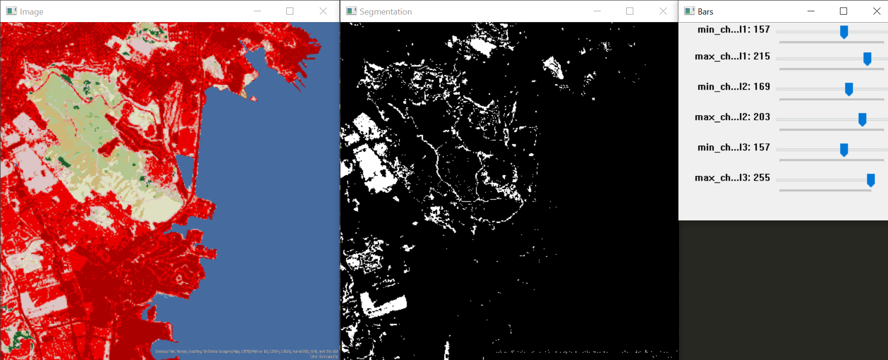

color-range-selector
====================

A Python - OpenCV application for selecting a range of color for segmenting images or videos.

## Usage

1. Run ``python color_range_selector.py``
2. Press [space] for pause or play, [r] for selecting color space BGR, [h] for color space HSV and [s] to save the current segmentation image.
3. Press [esc] to exit.

## Dependencies

* Python
* OpenCV

by Jesús Henriquez
